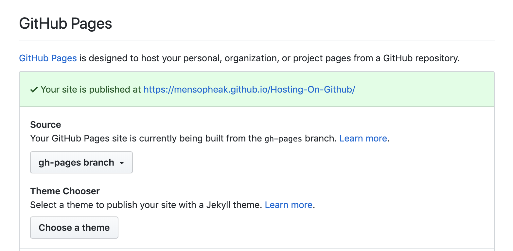

# Hosting On Github

> Create a new repository [your_website_name]
>
> Create a new branch **gh-pages**
>
> Setting > Branch > Default Branch > change it to **gh-pages** and update
>
> Create a new file **index.html** 
>
> Setting > Github Pages (we will find our published URL)
>
> [Link To Website](https://mensopheak.github.io/Hosting-On-Github/)

